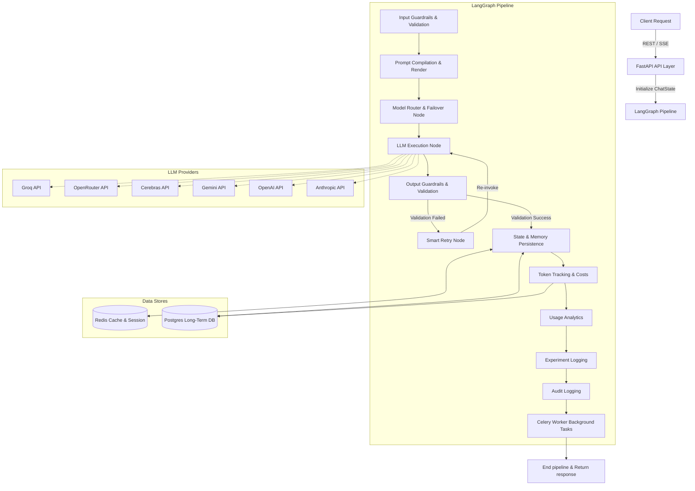

# 🌌 Altair AI

### *Enterprise-Grade, High-Performance AI Gateway Orchestrated via LangGraph*

[](https://opensource.org/licenses/MIT)
[](https://www.python.org/)
[](https://fastapi.tiangolo.com/)
[](https://nextjs.org/)
[](https://react.dev/)
[](https://www.typescriptlang.org/)
[](https://www.docker.com/)
[](https://www.postgresql.org/)
[](https://redis.io/)
[](https://www.langchain.com/)
[](https://langchain-ai.github.io/langgraph/)
[]()
[](https://github.com/deonbinny7/AltairAI/stargazers)
[](https://github.com/deonbinny7/AltairAI/issues)
[](https://github.com/deonbinny7/AltairAI/pulls)

---

Altair AI is an advanced, production-ready AI Gateway designed to route, monitor, secure, and persist large language model (LLM) workflows. Orchestrated via **LangGraph**, it enables enterprises to implement reliable multi-model routing, prompt versioning, dynamic memory, semantic caching, and strict input/output guardrails with zero latency impact.

## 🚀 Key Features

- 🔀 **Dynamic Provider Routing**: Automatic failover, load balancing, and explicit routing across OpenAI, Anthropic, Gemini, Groq, and Cerebras.
- 🛡️ **Strict Guardrails**: Input validation, prompt injection protection, PII masking, and JSON schema validation for LLM outputs.
- 🧠 **Dynamic Contextual Memory**: Contextual conversation retrieval using sliding-window Redis memory and PostgreSQL long-term persistence.
- 📝 **Enterprise Prompt Management**: Dynamic template compilation, prompt cache TTLs, and automatic key overrides.
- 📊 **Real-time Observability**: Structured logs via `structlog`, Prometheus metrics, OpenTelemetry traces, and detailed Celery task execution logging.
- ⚡ **Streaming SSE Support**: Seamless Server-Sent Events (SSE) streaming with active token tracking and token cost estimation.
- 🧪 **A/B Testing & Experiments**: Router latency monitoring, cost auditing, and concurrent model comparison.

---

## 🏛️ System Architecture

Altair AI processes incoming chat requests through a strict pipeline orchestrated as a directed acyclic graph (DAG) in **LangGraph**.



---

## 📂 Project Structure

```text

├── backend/                  # FastAPI Backend Application
│   ├── alembic/              # Database Migrations
│   ├── app/                  # Main Backend Code base
│   │   ├── ai/               # Providers Integration (Factory, Models)
│   │   ├── analytics/        # Cost tracking and metrics logging
│   │   ├── api/              # API Endpoint routers (v1/chat, auth, settings)
│   │   ├── auth/             # JWT Authentication logic & dependencies
│   │   ├── config/           # Pydantic Settings & Env setup
│   │   ├── core/             # Logging, OpenTelemetry, Security helpers
│   │   ├── db/               # PostgreSQL Connection, Engine & Sessions
│   │   ├── graph/            # LangGraph Nodes, States, & Workflow compilation
│   │   ├── memory/           # Redis Cache & DB Session helpers
│   │   ├── middleware/       # Exception Handling & Logging middleware
│   │   ├── models/           # SQLAlchemy DB Models (Users, Prompts, Logs)
│   │   ├── prompts/          # Prompt templates & variables database
│   │   ├── repositories/     # Repository pattern data access layer
│   │   ├── schemas/          # Pydantic Input/Output Validation schemas
│   │   ├── services/         # Business logic layer
│   │   └── main.py           # FastAPI entrypoint
│   ├── tests/                # Unit & Integration Tests (pytest)
│   ├── Dockerfile            # Development Docker Image
│   ├── Dockerfile.prod       # Production Docker Image
│   └── requirements.txt      # Python Dependencies
├── frontend/                 # Vite + React + TypeScript Dashboard
│   ├── src/                  # React Source Code
│   │   ├── components/       # Reusable UI Components (Charts, Tables)
│   │   ├── pages/            # View Pages (Playground, Analytics, Prompt Library)
│   │   ├── services/         # API Integration service layer
│   │   └── main.tsx          # Frontend entrypoint
│   ├── package.json          # Node dependencies & scripts
│   └── vite.config.ts        # Vite configuration
├── docs/                     # Comprehensive Architecture & User Guides
├── docker-compose.yml        # Development environment services setup
└── docker-compose.prod.yml   # Production environment services setup
```

---

## 🔧 Installation & Quick Start

### Prerequisites
- Docker & Docker Compose (v2.0+)
- Python 3.11+ (if running bare-metal)
- Node.js 18+ (if running bare-metal)

### Quick Run with Docker Compose (Recommended)

1. Clone the repository:
   ```bash
   git clone https://github.com/deonbinny7/AltairAI.git
   cd AltairAI
   ```

2. Setup your environment variables:
   ```bash
   cp .env.example .env
   # Open .env and add your respective API keys (Gemini, Groq, OpenRouter, etc.)
   ```

3. Spin up the application stack:
   ```bash
   docker compose up --build
   ```
   *This command starts FastAPI, Vite, Postgres, Redis, Prometheus, Grafana, and Celery workers.*

4. Access the applications:
   - **Frontend Dashboard**: `http://localhost:5173`
   - **FastAPI OpenAPI Documentation**: `http://localhost:8000/docs`
   - **Prometheus Metrics**: `http://localhost:9090`

---

## 📖 In-depth Documentation Guides

For specific components and configuration guides, refer to the following manuals:

* **[docs/ARCHITECTURE.md](file:///c:/Users/deonb/Desktop/GenAI%20Project/docs/ARCHITECTURE.md)**: Deep dive into state management, data flows, and databases.
* **[docs/SYSTEM_DESIGN.md](file:///c:/Users/deonb/Desktop/GenAI%20Project/docs/SYSTEM_DESIGN.md)**: Detail on patterns, retry logic, and guardrails.
* **[docs/INSTALLATION.md](file:///c:/Users/deonb/Desktop/GenAI%20Project/docs/INSTALLATION.md)**: Complete bare-metal and container installation instructions.
* **[docs/QUICK_START.md](file:///c:/Users/deonb/Desktop/GenAI%20Project/docs/QUICK_START.md)**: Hands-on guide to testing the APIs and running your first completions.
* **[docs/API_REFERENCE.md](file:///c:/Users/deonb/Desktop/GenAI%20Project/docs/API_REFERENCE.md)**: REST and streaming endpoint documentation with sample payloads.
* **[docs/LANGGRAPH.md](file:///c:/Users/deonb/Desktop/GenAI%20Project/docs/LANGGRAPH.md)**: Details on LangGraph compilation, states, and graph nodes.
* **[docs/PROVIDER_ROUTING.md](file:///c:/Users/deonb/Desktop/GenAI%20Project/docs/PROVIDER_ROUTING.md)**: Multi-model support, failovers, and cost estimation logic.
* **[docs/DEPLOYMENT.md](file:///c:/Users/deonb/Desktop/GenAI%20Project/docs/DEPLOYMENT.md)**: Production deployment guide for AWS, Vercel, Railway, and Docker.
* **[docs/TESTING.md](file:///c:/Users/deonb/Desktop/GenAI%20Project/docs/TESTING.md)**: How to run frontend/backend tests, coverage reports, and mocks.
* **[docs/TROUBLESHOOTING.md](file:///c:/Users/deonb/Desktop/GenAI%20Project/docs/TROUBLESHOOTING.md)**: Common errors, database connection issues, and celery logs.

---

## 🎨 Screenshots & UI Assets

All UI screenshots and mock assets are organized in the `/docs/assets` folder:
- **`dashboard.png`**: Multi-provider metrics, costs, and token throughput graphs.
- **`playground.png`**: Interactive model testbed with real-time SSE streaming.
- **`prompt_library.png`**: Interface for versioning prompts and setting template variables.
- **`analytics.png`**: Latency distribution histograms and A/B test results.

---

## 🗺️ Project Roadmap

- [x] LangGraph-orchestrated execution pipeline
- [x] Multi-model dynamic routing & failovers
- [x] PII masking and prompt injection guardrails
- [ ] User authentication and Role-Based Access Control (RBAC)
- [ ] Team management & organization billing accounts
- [ ] Built-in Retrieval-Augmented Generation (RAG) using pgvector
- [ ] Semantic prompt cache with embedding search
- [ ] Gateway marketplace for third-party plug-ins

---

## 🤝 Contributing

Contributions are highly appreciated! Please review **[CONTRIBUTING.md](file:///c:/Users/deonb/Desktop/GenAI%20Project/CONTRIBUTING.md)** and our **[CODE_OF_CONDUCT.md](file:///c:/Users/deonb/Desktop/GenAI%20Project/CODE_OF_CONDUCT.md)** before submitting pull requests.

## 🔒 Security

To report a vulnerability or read our security guidelines, please see **[SECURITY.md](file:///c:/Users/deonb/Desktop/GenAI%20Project/SECURITY.md)**.

## 📄 License

This project is licensed under the MIT License - see the **[LICENSE](file:///c:/Users/deonb/Desktop/GenAI%20Project/LICENSE)** file for details.

## 🏷️ GitHub Topics
`ai`, `llm`, `langchain`, `langgraph`, `fastapi`, `nextjs`, `react`, `typescript`, `python`, `redis`, `postgresql`, `docker`, `enterprise-ai`, `prompt-engineering`, `observability`, `analytics`, `generative-ai`
