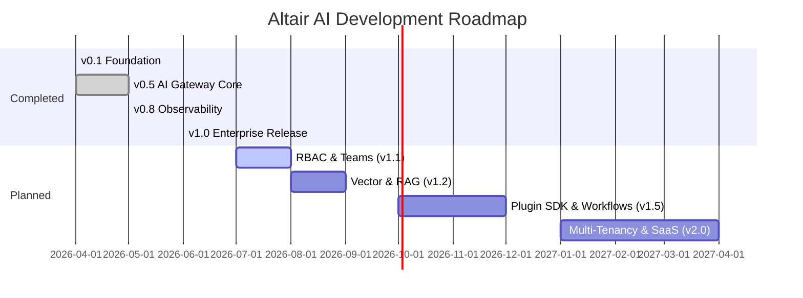

# Altair AI Project Roadmap

This roadmap outlines the planned development path for Altair AI. It details short-term, mid-term, and long-term goals for building a next-generation, secure, and performant AI Gateway.

---

## 🗺️ Current Milestones

---

## 🎯 Detailed Milestones

### 🟢 Q3 2026 (v1.1 - v1.2) - Identity & Context
- [ ] **Advanced Authentication & RBAC**:
  - Integrate OpenID Connect (OIDC), OAuth2, and SAML providers (Okta, Keycloak, Auth0).
  - Implement granular Role-Based Access Control (RBAC) for managing permissions at the team and workspace level.
- [ ] **Teams and Organizations**:
  - Add workspace isolation, allowing multiple developers to collaborate in shared project directories.
  - Organization-level api key quotas and cost limits.
- [ ] **RAG Engine & Semantic Cache**:
  - Integrate `pgvector` inside PostgreSQL for local embedding generation and document ingestion.
  - Implement a highly-performant semantic prompt cache in Redis, reducing duplicate LLM calls and costs.

### 🟡 Q4 2026 (v1.3 - v1.5) - Extensibility & Workflows
- [ ] **Gateway Plugin SDK**:
  - Expose a WebAssembly (Wasm) or Python-based plugin interface allowing custom middleware to intercept incoming requests and outgoing completions.
- [ ] **Agent Workflows**:
  - Support execution of dynamic LangGraph-based agents directly on the gateway.
  - Visual builder interface for designing router flows and agent graphs in the dashboard.
- [ ] **Model Routing Marketplace**:
  - A dashboard section to import/export routing rules, template prompt bundles, and safety guardrails.

### 🔴 H1 2027 (v2.0) - SaaS & Multi-Tenancy
- [ ] **Multi-Tenancy Architecture**:
  - Separate database schemas or logical tenancy isolation for secure cloud hosting.
- [ ] **Enterprise Billing & Usage Audits**:
  - Detailed billing calculations, metered billing via Stripe, and monthly compliance audit reports.
- [ ] **Cloud-Native Deployment Orchestration**:
  - Kubernetes operators and Helm charts for horizontal auto-scaling deployment.

// Code style format review — 2026-06-08T13:04:40
