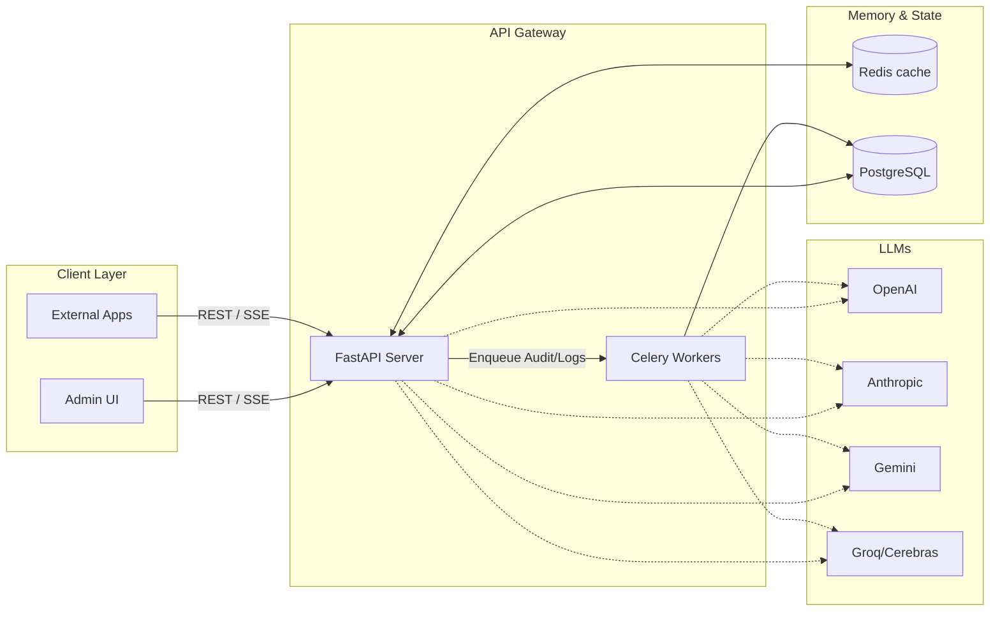

# Architecture Reference — Altair AI

This guide details the core software architecture, data flows, state models, and databases of Altair AI.

---

## 🏛️ High-Level System Architecture

Altair AI is built as a modular monorepo. It leverages a modern asynchronous Python stack for performance, alongside a Vite-based React frontend for the administration console and playground.

---

## 🔁 Request Execution Pipeline (LangGraph)

Every incoming request to `/api/v1/chat` or `/api/v1/stream` starts an execution graph run. 

1. **Input Guardrails**: Validates parameters, masks PII (e.g. phone numbers, emails), and runs safety filters.
2. **Prompt Compilation**: Merges template prompt strings with runtime variables retrieved from the prompt manager.
3. **Model Router**: Checks the chosen routing strategy (explicit, fallback, or cost-based) and selects the appropriate provider client.
4. **LLM Invocation**: Sends the prompt payload to the designated API endpoint (e.g. Groq, Cerebras, OpenAI).
5. **Output Guardrails**: Compares output against schemas, checks content safety, and tracks potential prompt leak attempts.
6. **Persist State**: Saves messages to Redis (short-term window) and PostgreSQL (long-term historical logs).
7. **Background Actions**: Triggers background auditing and analytics tracking via Celery.

---

## 🗄️ Database Schemas (PostgreSQL)

The relational schema is configured with SQLAlchemy and managed via Alembic.

### Core Tables:
* **`users`**: Stores user authentication credentials, emails, full names, and hashed passwords.
* **`sessions`**: Represents conversations, linking users to specific execution history.
* **`messages`**: Contains individual query/completion exchanges, storing token counts, latency metrics, and actual model overrides.
* **`prompts`**: Holds reusable templates, versions, and variable tags.
* **`audit_logs`**: Chronological record of administrative events, settings overrides, and guardrail violations.
* **`experiments`**: Tracks multi-model latency results, token efficiency, and provider response times.

// Code style format review — 2026-06-11T13:20:34
