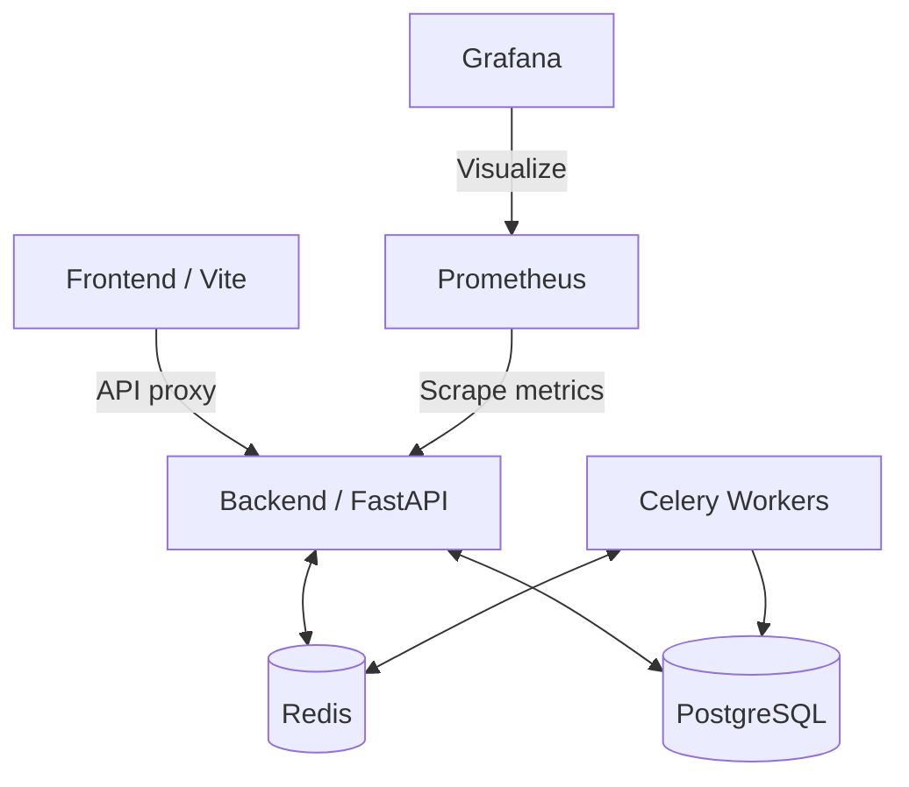

# Docker Reference Guide — Altair AI

This guide details the container structure, volumes, and networking configurations used in Altair AI.

---

## 🗃️ Container Service Mesh

The architecture leverages multi-container setups defined in `docker-compose.yml`:

---

## 🗂️ Docker Services Configuration

### 1. `db` (Postgres)
* Image: `postgres:15-alpine`
* Volume: `pg_data` mapped to `/var/lib/postgresql/data` to persist session and user history.
* Port: `5432`

### 2. `db_redis` (Redis Cache)
* Image: `redis:7-alpine`
* Volume: `redis_data` mapped to `/data` to persist sliding-window chat history.
* Port: `6379`

### 3. `backend` (FastAPI)
* Dockerfile: `/backend/Dockerfile`
* Relies on multi-stage builds. Installs gcc compiling dependencies, caches wheels, and uses a lightweight python-slim image for execution.
* Environment: Injects database and provider URL linkages.

### 4. `celery_worker` (Task Executor)
* Dockerfile: Reuses `/backend/Dockerfile`
* Command: `celery -A app.workers.celery_app.celery worker --loglevel=info`

### 5. `frontend` (React static)
* Dockerfile: `/frontend/Dockerfile`
* Runs a Node build process to output public statics, serving them using Nginx in production compose setups.

// Code style format review — 2026-06-07T14:43:06
